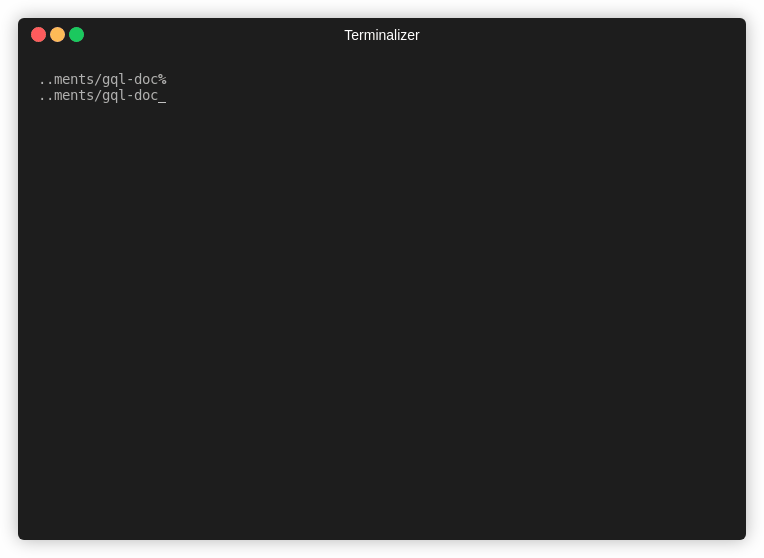

# gql-doc
Simple tools for generating documentation from graphQL Specs


## Installation

```sh
$ go get github.com/alvinmatias69/gql-doc
```

gql-doc project is developed using `go 1.13.5`. It's possible to use in another go version, but there's no guarantee that it will works as expected.

## Usage
```sh
gql-doc [-help] [-ip] [-out] [-template]

Options:
        -help           Show help screen

        -ip             Set input search path, should include 
                        `queries.go` and `mutations.go`
                        [ default: "./" ]

        -out            Set documentation output path
                        on empty the generated docs will be print to stdout
                        [ default: "" ]

        -template       Use template for documentation
                        supply path to use custom template
                        [ html | markdown | default: json ]

Example:
        gqldoc -ip=affiliate -out=doc.json
        gqldoc -ip=affiliate -out=doc.md -template=custom-md.tmpl
```

For more example on specs file and generated output you can refer to [example](example/) directory.

## GraphQL Specs

```go
package gqlDocumentation

var query = `
	getImages(id:[Int!]!): Images!
`

var queryType = `
# Query to get User Images
type Images {
	data: [String]
}

`
```

GraphQL specs is written in go. Generally used to generate general files of graphql project. Basically it has 3 main properties: package name, method, and types.
`gql-doc` will look for `queries.go` for gql query and `mutations.go` for gql mutations in given directory.

## Template
Templates are written in golang [template](https://golang.org/pkg/text/template/). You can provide a custom template for your needs. The given data is defined by `GQLDoc` struct at [entity.go](entity.go) file.

## TODO
- [ ] Tidy up functions and go comment
- [ ] Add ability to read custom query and mutation files
- [ ] Improve default template visually
